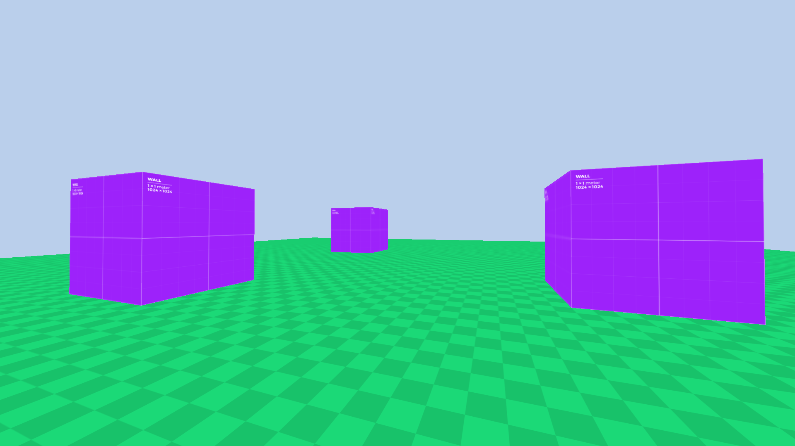

# Neonix Engine

Neonix is a simple C++ game and rendering engine built with OpenGL. It’s designed as a learning project focused on clean architecture and extendable systems.

## Screenshots

*Basic shape rendering with textures*

## Current Features
- Input System
- 3D Camera System
- Material System
- Basic Shape Generation

## Upcoming Features
- Physically Based Rendering (PBR)
- Event System
- Model Loading
- More to come!

## Building from Source
### Linux
#### Make sure you have these installed.
- CMake
- C++ Compiler clang or g++
- glew
- glfw
- glm

### Build Instructions

```bash
git clone https://github.com/VoidSoup42/Neonix.git
cd Neonix
mkdir Build && cd Build
cmake ..
make -j
```

### Running the Sandbox

After building, you can run the sandbox application:
```bash
cd Sandbox && ./Sandbox
```

## Dependencies
- GLFW: Window and input management
- GLEW: for using modern OpenGL
- GLM: for maths
- STB Image: Image loading library

## License
This project is licensed under the MIT License - see the [LICENSE](LICENSE) file for details.

## Contributing
Contributions are welcome! Please feel free to submit a Pull Request.
